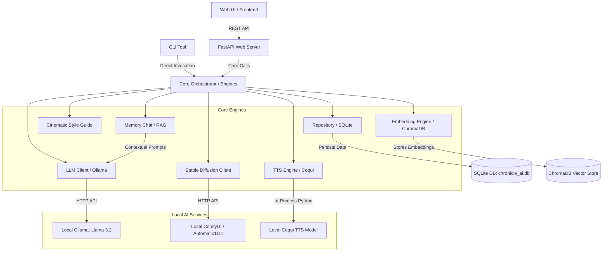

# 🏗️ Architecture & System Design

This document details the system design, data flow, and components of Chronicle AI.

---

## 🗺️ System Architecture

The diagram below shows how different components in Chronicle AI interact with each other and the external local services:

---

## 📦 Component Explanations

Chronicle AI is modularly divided into several components within the `src/chronicle_ai/` package:

### 1. Storage & Persistence
- **[repository.py](file:///c:/Users/hp/Desktop/Riju/Habit%20Cinematic/src/chronicle_ai/repository.py)**: Implements the Repository pattern to interact with the SQLite database. It manages CRUD operations for diary entries, seasons, settings, and chat history.
- **[models.py](file:///c:/Users/hp/Desktop/Riju/Habit%20Cinematic/src/chronicle_ai/models.py)**: Defines the primary data models (e.g., `Entry`, `Season`, `ConflictData`, `ChatMessage`, `ChatSession`) as Python classes.

### 2. Large Language Model (LLM) Integration
- **[llm_client.py](file:///c:/Users/hp/Desktop/Riju/Habit%20Cinematic/src/chronicle_ai/llm_client.py)**: Orchestrates local inference using Ollama. It converts diary raw logs into third-person narratives, creates catchy episode titles, extracts keywords, locations, and characters, and constructs conflict analyses.
- **[style_guide.py](file:///c:/Users/hp/Desktop/Riju/Habit%20Cinematic/src/chronicle_ai/style_guide.py)**: Standardizes visual elements, camera directions, lighting presets, and sensory descriptions using `style_config.json` to guide the LLM's narrative formatting.

### 3. Vector Database & RAG
- **[embedding_engine.py](file:///c:/Users/hp/Desktop/Riju/Habit%20Cinematic/src/chronicle_ai/embedding_engine.py)**: Configures ChromaDB and generates embeddings for diary text blocks. It uses sentence-transformers (`all-MiniLM-L6-v2`) locally or `mxbai-embed-large` via Ollama.
- **[semantic_search.py](file:///c:/Users/hp/Desktop/Riju/Habit%20Cinematic/src/chronicle_ai/semantic_search.py)**: Runs vector database semantic queries. It supports filtering entries by seasons, dates, and mood tags.
- **[memory_chat.py](file:///c:/Users/hp/Desktop/Riju/Habit%20Cinematic/src/chronicle_ai/memory_chat.py)**: RAG (Retrieval-Augmented Generation) chat interface. Retrieves relevant context from vector storage and presents it to Llama 3.2 to answer historical questions.

### 4. Media Generators
- **[image_client.py](file:///c:/Users/hp/Desktop/Riju/Habit%20Cinematic/src/chronicle_ai/image_client.py)**: Connects to ComfyUI/Automatic1111 APIs. It translates mood keywords into descriptive prompt layers (styles: Cinematic, Anime, Noir, Watercolor, Minimalist).
- **[tts_client.py](file:///c:/Users/hp/Desktop/Riju/Habit%20Cinematic/src/chronicle_ai/tts_client.py)**: Wraps Coqui TTS for offline audiobook narration. Converts text into high-fidelity speech files.

### 5. Narrative Analysis
- **[season_manager.py](file:///c:/Users/hp/Desktop/Riju/Habit%20Cinematic/src/chronicle_ai/season_manager.py)**: Groups diary entries chronologically and identifies overarching themes and character milestones to partition episodes into cohesive "seasons."
- **[arc_analyzer.py](file:///c:/Users/hp/Desktop/Riju/Habit%20Cinematic/src/chronicle_ai/arc_analyzer.py)**: Evaluates user's personal growth or habit patterns on specific areas (e.g. career, fitness) over time.
- **[recap.py](file:///c:/Users/hp/Desktop/Riju/Habit%20Cinematic/src/chronicle_ai/recap.py)**: Generates a recap text summarizing the previous week's main conflicts and highlights.
