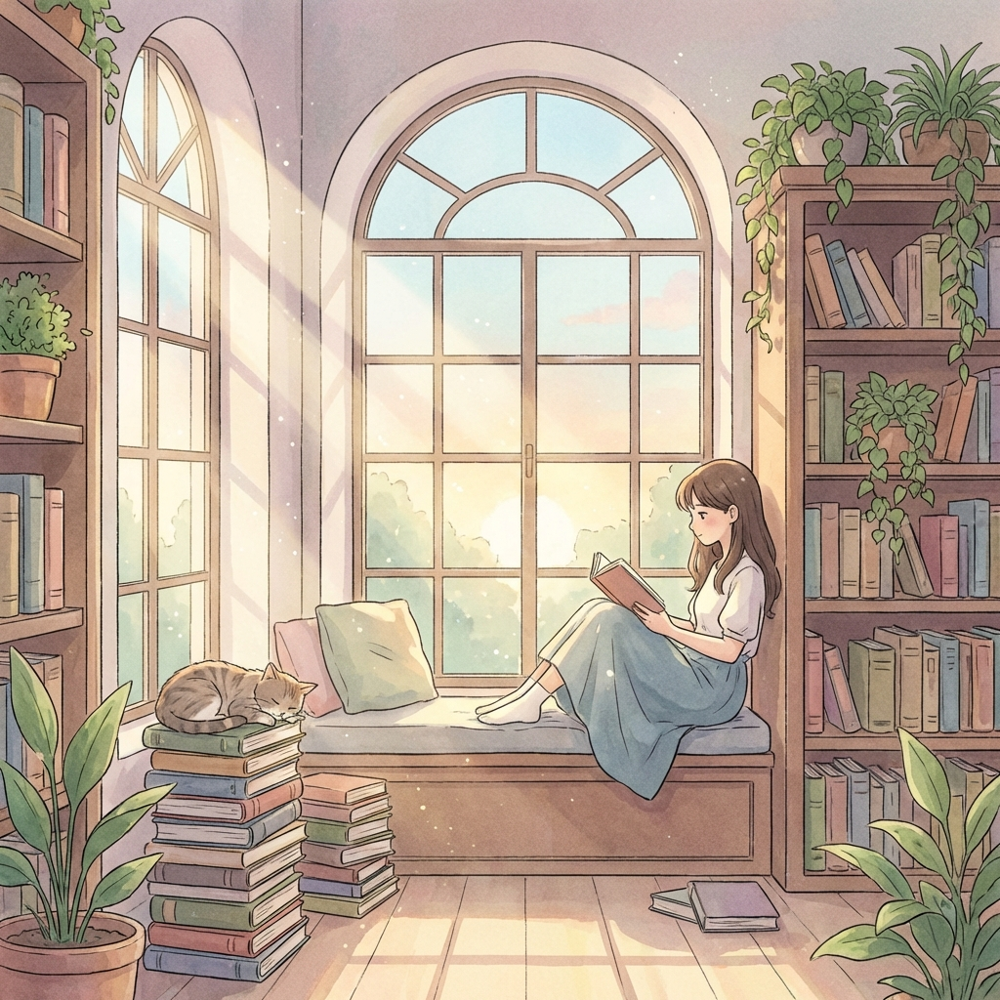
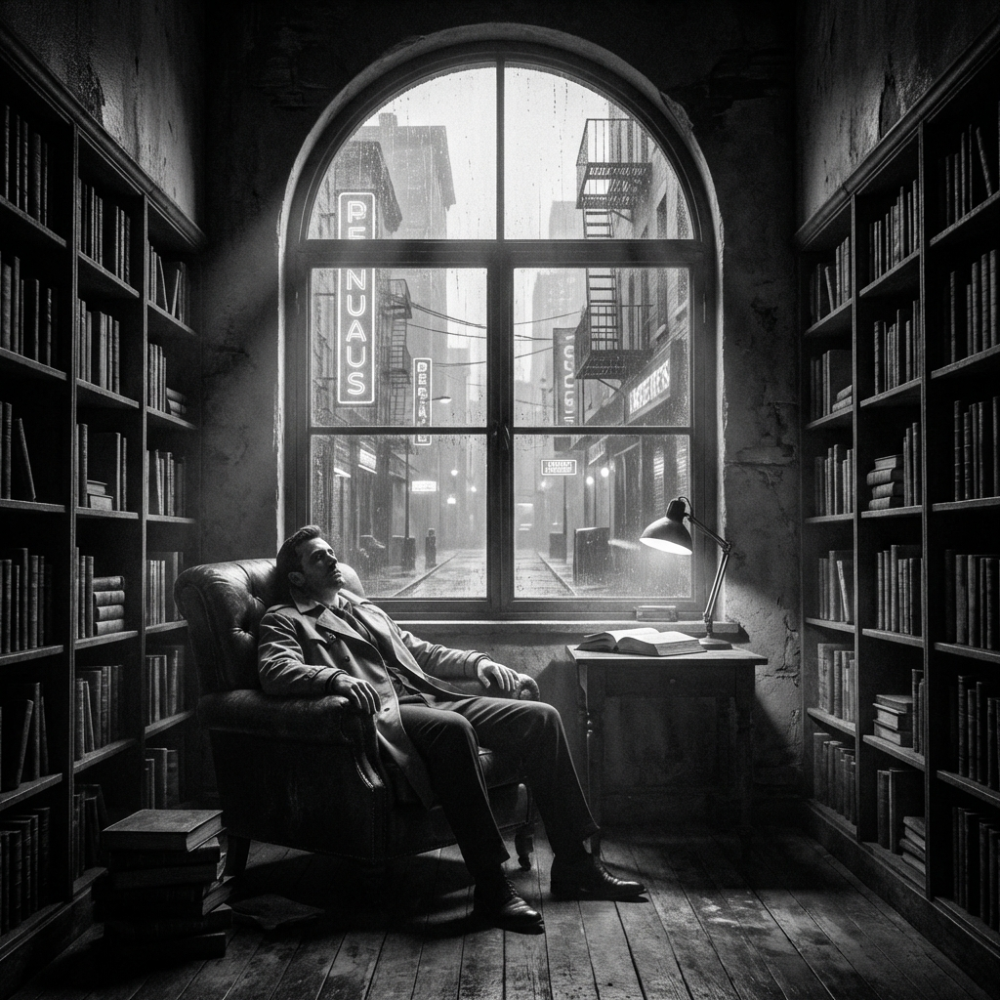
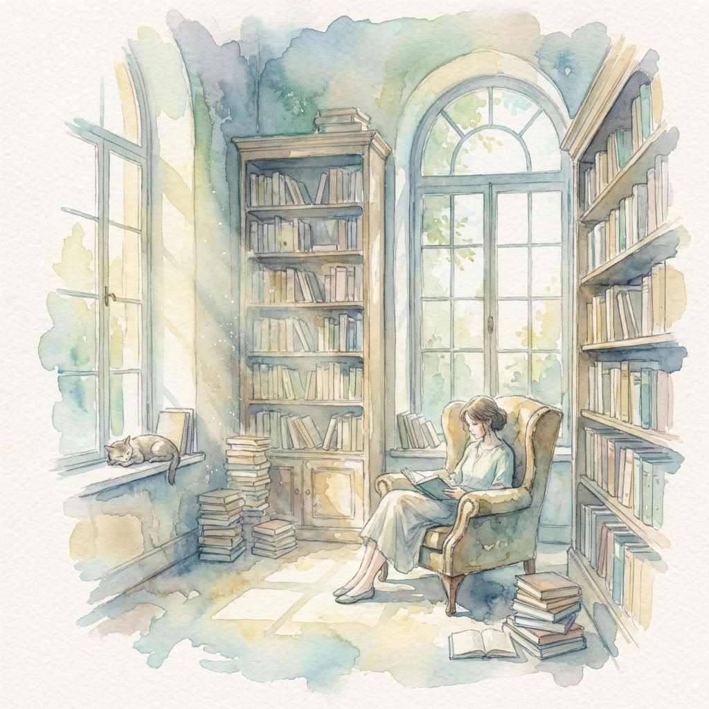
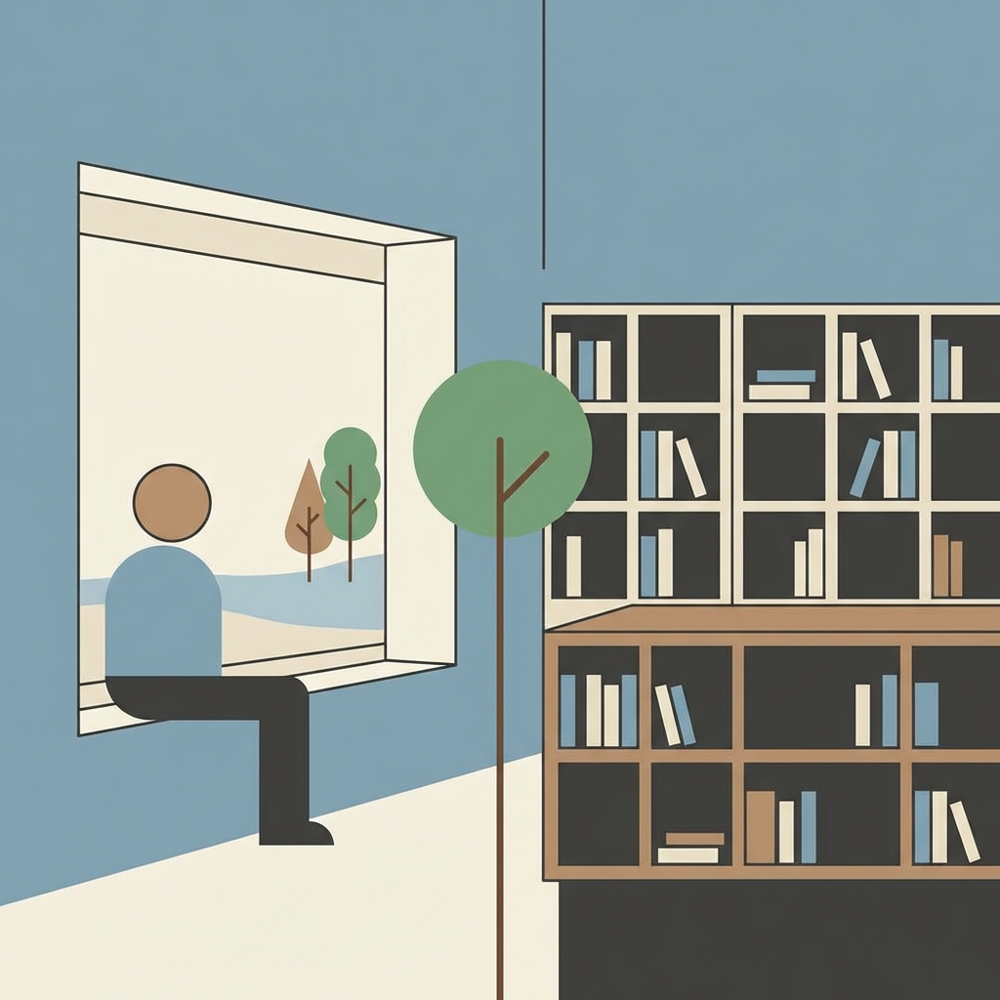

# 🎨 Visual Style Presets

Chronicle AI supports 5 distinct visual looks for your episode cover art. You can switch between these styles using the CLI.

## How to Configure
To set your preferred style, use the following command:
```bash
chronicle config --style <style_name>
```

Available styles: `cinematic`, `anime`, `noir`, `watercolor`, `minimalist`.

---

## 🎬 CINEMATIC (Default)
**Description:** Film grain, dramatic lighting, realistic photography style.
- **Positive Prompt:** Cinematic film, 35mm, film grain, dramatic lighting, realistic photography...
- **Sampler:** DPM++ 2M Karras
- **Steps:** 30


---

## 🌸 ANIME
**Description:** Studio Ghibli inspired, soft colors, illustrated style.
- **Positive Prompt:** Studio Ghibli style, anime art, soft colors, illustrated, cel shading...
- **Sampler:** Euler a
- **Steps:** 25



---

## 🕵️ NOIR
**Description:** Black and white, high contrast, dramatic shadows.
- **Positive Prompt:** Black and white, high contrast, dramatic shadows, film noir, gritty...
- **Sampler:** DPM++ SDE Karras
- **Steps:** 35



---

## 🎨 WATERCOLOR
**Description:** Soft, artistic, dreamy, painterly.
- **Positive Prompt:** Watercolor painting, soft artistic edges, dreamy, painterly style...
- **Sampler:** Euler a
- **Steps:** 20



---

## 📐 MINIMALIST
**Description:** Simple shapes, limited palette, clean design.
- **Positive Prompt:** Minimalist design, simple shapes, limited palette, clean lines, flat design...
- **Sampler:** DPM++ 2M Karras
- **Steps:** 25


